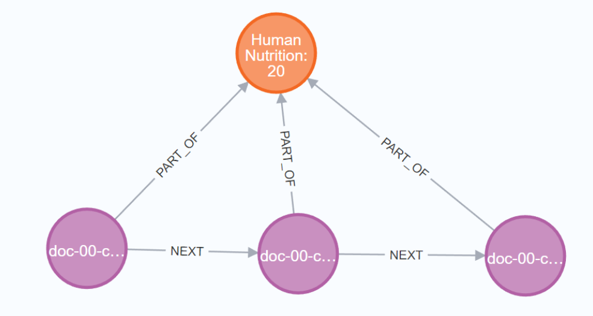

# Building RAG system from Unstructured data

This is a research project aimed to create an efficient system for RAG which capable of retrieving information from unstructured data while maintaining high performance and accuracy when retrieving.

Currently, the project is built to handle documents in text format (PDFs, Markdown, text, ...). The documents include books and articles from various categorical fields. Since the documents are from different sources and not sharing a common structure, this presents challenges in processing, extraction and designing database structure.

All the detail of development of each version is inside **build.ipynb**

> ## System v1

This is a simple Retrieval Augmented Generation architecture from scratch, using list as a vector store.

- **Chunk method**: Character Text Chunking

- **Embedding model**: BAAI/bge-small-en-v1.5

- **Searching**: Using consine-similarly ranking

- **LLM**: Gemini 

**Result**:

The model was able to retrieved information from vector store. However, there are some drawbacks:
- **Inefficient database**: The database is list of chunks, even for vector DB is still simple. When performing semantic search, it has to go through all the chunks in the list. For larger database, this will slow down performance. Beside, the search may go through the chunks that are irrelevant to the question.

- **Searching**: If the desired information is long in the pdf, which need to divide into many chunks. The search may not capture all of the chunks in the information. This leads to fragmented information, making model confused and return untrue data.

 

> ## System v2

For the second system, knowledge graph has been applied in order to retrieve more information and relationship between each chunk (using Neo4j Cypher as graph database)

- **Chunk method**: Character Text Chunking

- **Embedding model**: Gemini Embedding model

- **Database structure**: The database structure is a combination of graphs and vectors, allowing to perform similarity search but also present relationship in the data.

- **LLM**: Gemini

- `Doc`: Document Node containing *title* (name of document) and *author* (author of that document) properties.

- `Chunk`: Chunk Node containing *chunkId*, *text*, and *embedding* (the embedding vector of the chunk).

- The Chunk node has a `PART_OF` relationship to the Doc node, indicating which document the chunk belongs to.

- Each chunk will have a `NEXT` relationship, pointing to the next chunk in document flow (like Linked List) 

**Result**:

The model was able to retrieve information from the database, and additional data was provided by including neighboring chunks of the top-scoring chunks. However, as more documents are added to the database, performance and accuracy decline. This is due to the current preprocessing and chunking methods being too simple, which limits the ability to improve the database structure.

 
