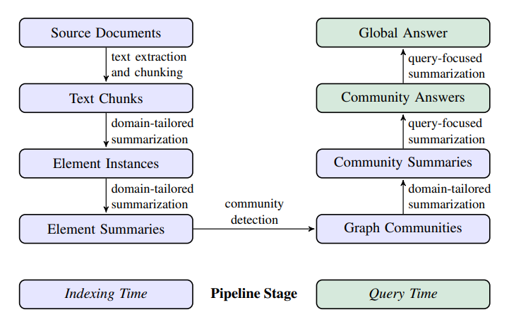

# Retrieval Augmented Generation

Chatbots have become widely popular due to their large knowledge base and ability to provide accurate responses, powered by LLMs. In order to provide vast and up-to-date information, chatbot applications use a technique called Retrieval-Augmented Generation (RAG). This approach also help LLMs to answer questions about specific source information or unseen dataset.

This project researches on building an efficient RAG for different purposes, provides a documentation of various RAG implementations, from building RAG systems from scratch to exploring state-of-the-art solutions.

All the detail of development of each version is inside **build.ipynb**

## System v1

This is a simple local Retrieval Augmented Generation architecture from scratch, using list as a vector store.

- **Chunk method**: Character Text Chunking

- **Embedding model**: BAAI/bge-small-en-v1.5

- **LLM**: Gemini 

**Result**:

The model was able to retrieved information from vector store. However, there are some drawbacks:
- **Inefficient database**: The database is list of chunks, even for vector DB is still simple. When performing semantic search, it has to go through all the chunks in the list. For larger database, this will slow down performance. Beside, the search may go through the chunks that are irrelevant to the question.

- **Searching**: If the desired information is long in the pdf, which need to divide into many chunks. The search may not capture all of the chunks in the information. This leads to fragmented information, making model confused and return untrue data.

 

## System v2

For the second system, knowledge graph has been applied in order to retrieve more information and relationship between each chunk (using Neo4j Cypher as graph database)

- **Chunk method**: Character Text Chunking

- **Embedding model**: Gemini Embedding model

- **Database structure**: The database structure is a combination of graphs and vectors, allowing to perform similarity search but also present relationship in the data.

- **LLM**: Gemini

- `Doc`: Document Node containing *title* (name of document) and *author* (author of that document) properties.

- `Chunk`: Chunk Node containing *chunkId*, *text*, and *embedding* (the embedding vector of the chunk).

- The Chunk node has a `PART_OF` relationship to the Doc node, indicating which document the chunk belongs to.

- Each chunk will have a `NEXT` relationship, pointing to the next chunk in document flow (like Linked List) 

**Result**:

The model was able to retrieve information from the database, and additional data was provided by including neighboring chunks of the top-scoring chunks. However, as more documents are added to the database, performance and accuracy decline. This is due to the current preprocessing and chunking methods being too simple, which limits the ability to improve the database structure.

 

## System v3

The system v3 is a re-implementation of [Microsoft GraphRAG](https://microsoft.github.io/graphrag/) and also from research paper: [From Local to Global: A Graph RAG Approach to Query-Focused Summarization](https://arxiv.org/abs/2404.16130). 

Different from origin RAG approach, which getting answer from relevant chunks in the vector-store, the paper has provided a approach which using LLMs to create a knowledge graph based on an input corpus. The LLMs fist to identify the entities and relationships throughout the document, then generate a community summaries for all groups of closely-related entities. When a user enters a query, each community summary is used generate a partial answer, then all partial answers are aggregated into a final answer.

With this approach, the system can provided more complete and detailed information from a large dataset or data collection. In origin RAG system, the most relevant chunks to the query are retrieved for LLM. However, those relevant chunks are not always able to form a fully needed information, especially in larger dataset. Beside, those chunks may provide partial information, while some chunks are totally irrelevant to the main point of the question. 

This implementation version is based on the paper's pipeline. Unlike the [GraphRAG](https://github.com/microsoft/graphrag) source code which uses tables for data storage, this version utitlized Neo4j Graph Database, enhancing scalability and efficiency in graph operation. There are some limitations of this implementation:
- From preprocessing to summarization and database storage, the pipeline relies heavily on the involvement of Large Language Models (LLMs). The choice of LLM and careful prompt fine-tuning are crucial to achieving more accurate extraction results and summaries.
- This approach is designed for datasets containing information about or related to specific individuals, groups, or organizations. It is not suitable for storing generalized information, such as rules, laws, or factual data.
